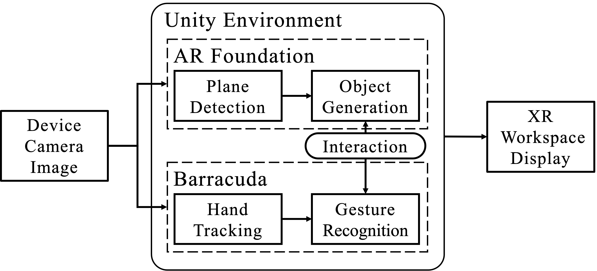
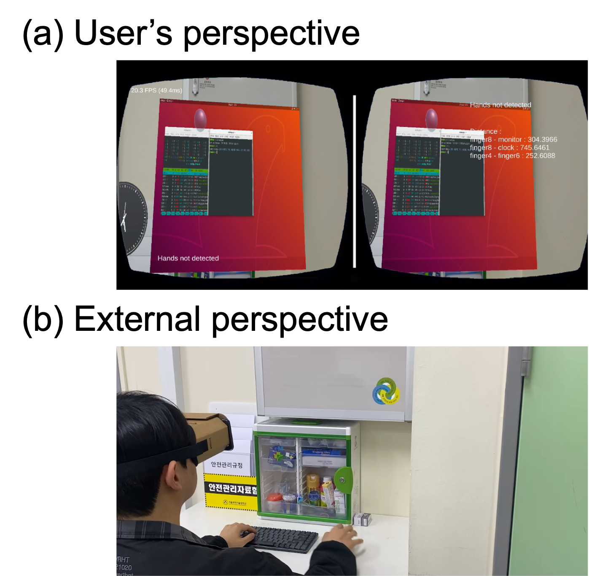
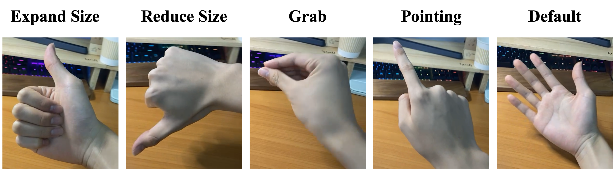
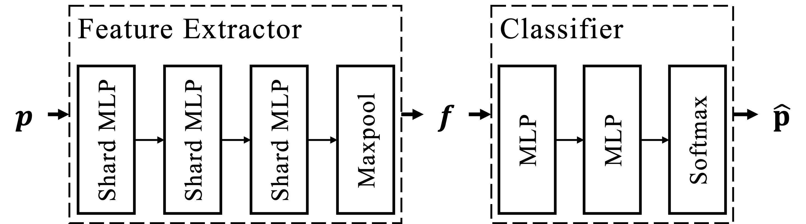
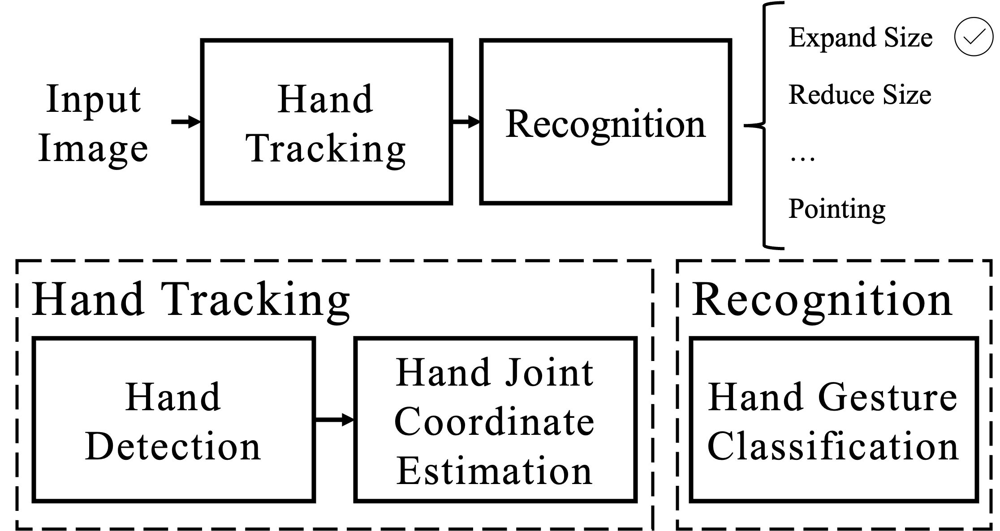
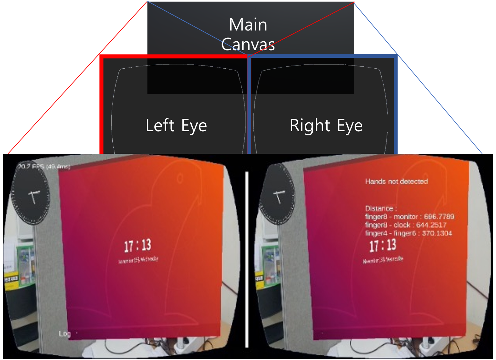

# On-device-XR-Workspace-System
On-device XR Workspace System Using Real-time Hand Gesture Recognition (Undergraduate Capstone Project)
> The `Library/` folder has been excluded from this repository due to GitHub's file size limitations.

### Project Overview
___

This project implements a mobile on-device extended reality (XR) workspace system.
Users can intuitively interact with virtual objects through hand gestures, without relying on external servers.
The system is built using the `Unity` engine, integrates a lightweight deep learning model for `hand tracking` and `gesture recognition`, and runs as a real-time `Android`application.
The repository contains all related Unity project files, the deep learning hand gesture model integration, and Android build resources necessary for operating the XR workspace on mobile devices, LG G7 ThinQ(LM-G710N).

---

1. **User Interface (Unity & AR Foundation)**

    This project was developed and built using Unity and AR Foundation, targeting Android devices.

    - Unity Version: 2021.3.3f1
    - AR Foundation Version: 4.2.8
    - Target Platform: Android

    

   
    

---

2. **Hand Tracking & Gesture Recognition**
    
    - Hand Tracking : This project actively utilizes Google's [MediaPipe](https://ai.google.dev/edge/mediapipe/solutions/guide?hl=ko) framework for hand tracking and landmark estimation.
    In particular, I made extensive use of the [MediaPipeUnityPlugin](https://github.com/homuler/MediaPipeUnityPlugin) repository, which provides a Unity plugin for MediaPipe integration.
    - Gesture Recognition : a custom model was designed and trained using `PyTorch` with a dataset collected specifically for this project.

        

        
        
        

        The trained model was then exported to an `ONNX` file format.

        In the Unity application, the model is executed using `Barracuda` to enable real-time gesture inference on mobile devices.

        

        
        

        model weights : /Assets/MyObjects/ours.onnx  
        code : /Samples/Scenes/Hand Tracking/HandTrackingSolution.cs (line 99-141)

    - Gesture-Object Interaction

        The algorithms for handling gesture-object interaction are implemented in `Assets/MyScripts/raycast_script_hand.cs`.  
        These algorithms control the object's size, orientation, appearance, and other interactive behaviors based on recognized gestures.

---

3. **VNC Remote Desktop**

    This project actively utilizes the [Unity-VNC-Client](https://github.com/cfloutier/Unity-VNC-Client) open-source repository to implement the VNC Remote Desktop functionality.

---

4. **Fish-eye Effect for Spatial Perception**

    

    
    

    
    Since mobile device screens are inherently 2D, providing true spatial perception like that of VR devices such as Vision Pro or Meta Quest is limited.  
    To partially simulate spatial depth, a distortion-based projection technique was applied to enhance the sense of space within the application.

---
### Demo

> [Click](https://www.youtube.com/watch?v=HIL7bhvVAHo) to watch on YouTube